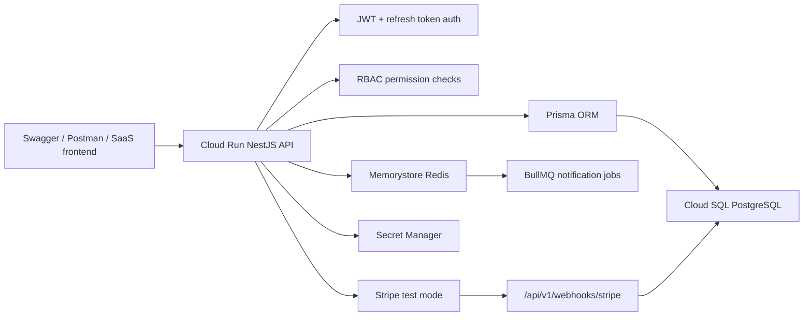
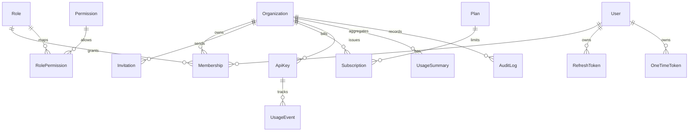

# Architecture

The API is organized around organization tenancy. A user may belong to many organizations through memberships, and organization-owned resources include subscriptions, API keys, usage summaries, invitations, and audit logs.

## Domain Model

## Security Model

- Access tokens are short-lived JWTs.
- Refresh tokens are opaque random strings stored as hashes.
- Refresh token reuse revokes the full token family.
- Password reset revokes active refresh token families.
- API keys are shown once and stored as hashes.
- Stripe webhook signatures are verified before processing.

## Tenant Model

- Billing belongs to organizations, not individual users.
- Usage is tracked per organization and feature.
- Permission checks use `can(userId, permission, orgId)`.
- Platform admins can inspect platform state but do not become organization members automatically.

## Deployment

- Cloud Run hosts the NestJS API.
- Cloud SQL PostgreSQL stores tenant, auth, billing, usage, and audit data.
- Memorystore Redis backs BullMQ notification jobs.
- Secret Manager stores database, JWT, Stripe, and bootstrap admin secrets.
- Artifact Registry stores versioned API container images.
- Terraform provisions staging infrastructure and controls whether Cloud Run is private or public.
